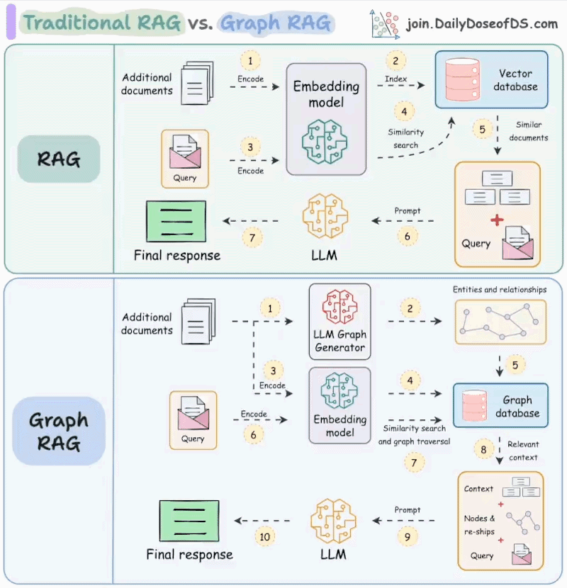

# 第一节：基于知识图谱的RAG

传统RAG框架虽然有效缓解了大型语言模型的知识陈旧和幻觉问题，但在处理复杂查询时仍存在明显局限。依赖非结构化文本向量检索的方式，往往难以捕捉实体间的深层关系，导致上下文检索不精确、信息碎片化，甚至诱发模型产生"幻觉"。

为了突破这些瓶颈，将结构化知识图谱融入RAG流程的新范式——KG-RAG应运而生。通过利用知识图谱的显式语义关系和图结构优势，KG-RAG能够提供更精准的上下文检索和更强的推理能力，在多跳查询和事实性要求较高的场景中表现尤为出色。

## 一、从传统RAG到知识图谱增强RAG的演进

### 1.1 传统RAG框架的固有局限性

尽管传统RAG通过"检索-生成"两阶段流程在一定程度上解决了LLM的知识更新问题，但其基于非结构化文本向量检索的核心机制仍存在几个关键局限。

**关系理解的缺失**：基于向量的检索主要关注语义相似性，难以捕捉和利用实体之间复杂的、隐含的关系。当查询涉及多实体关联或因果推理时，检索到的文本块之间可能缺乏逻辑联系，导致LLM难以进行有效的综合与推理。

**上下文的碎片化**：文本被切分成独立的块进行索引，这破坏了原文的结构和上下文连续性。对于需要跨越多个文档或长距离文本进行信息整合的问题，传统RAG往往力不从心。

**检索噪声与幻觉风险**：检索过程可能返回不相关或仅部分相关的噪声信息，这会干扰LLM的判断，甚至诱发其产生与事实不符的"幻觉"内容。知识图谱的引入被证实能有效减轻模型幻觉，提供更高质量的上下文。

**推理能力有限**：传统RAG的推理能力受限于检索到的线性文本内容，难以支持需要结构化知识进行导航的多跳推理。

### 1.2 知识图谱赋能RAG的核心优势

知识图谱通过节点（实体）和边（关系）的网络结构，将离散的知识显式地组织成一个相互连接的语义网络，为克服传统RAG的局限性提供了强有力的解决方案。

**结构化语义表达**：知识图谱以图的形式直接编码实体间的显式语义关系（如"公司A-收购-公司B"），避免了LLM从文本中进行隐式、可能存在偏差的推断，为复杂查询提供了清晰的导航路径。

**增强推理能力**：图的结构天然支持多跳推理，系统可以沿着图中的路径遍历，发现间接但关键的知识关联，从而回答需要多步逻辑推导的复杂问题。

**事实性与可解释性**：基于知识图谱检索的答案可以追溯其在图中的推理路径，这为答案提供了事实依据，极大地增强了系统的可解释性和可信度，有效抑制了幻觉。

**异构数据集成**：知识图谱能够无缝集成来自不同来源的结构化（如数据库）和非结构化（如文本）数据，形成一个全面、统一的知识视图，这在金融、医疗等需要整合海量异构信息的领域尤为重要。

### 1.3 KG-RAG：一种范式革新

KG-RAG将检索的目标从独立的文本片段转变为在知识图谱中寻找相关的实体、关系、路径或子图。这一转变从根本上提升了RAG系统的能力。实证研究表明，KG-RAG在多个关键指标上显著优于传统RAG。例如，有研究指出，引入知识图谱后，上下文召回率可从传统RAG的约80%提升至95%以上，而多跳查询的准确率则从48%跃升至89%。这标志着RAG技术从"信息检索"向"知识利用"的范式演进。

## 二、KG-RAG框架的核心架构与工作流程

大多数KG-RAG框架遵循一个通用的三阶段流程：知识图谱构建、图谱检索与增强生成。

### 2.1 通用架构三阶段

**知识图谱构建 (Knowledge Graph Construction)** 是KG-RAG的基础。该阶段的目标是从原始数据中构建一个高质量的知识图谱。知识抽取环节利用LLM强大的自然语言理解能力，从非结构化或半结构化文本中自动抽取实体、关系以及属性，形成知识三元组（例如，<实体A, 关系, 实体B>）。随后的图谱融合与存储将抽取的知识三元组与现有知识进行对齐、融合和去重，并存入专门的图数据库（如Neo4j）中，以便进行高效的图查询和遍历。

**图谱检索 (Graph Retrieval)** 阶段，当用户提出查询时，系统不再是简单地进行向量相似度搜索，而是执行更复杂的图谱检索操作。混合检索策略是主流趋势，例如，首先通过向量检索定位查询中的核心实体节点，然后从这些节点出发，利用图查询语言（如Cypher）或图遍历算法进行子图探索、路径发现。一些高级框架（如GraphRAG）会采用社区检测算法（如Leiden算法）将图谱划分为语义社区，并生成摘要，从而实现从局部细节到全局概览的多层次上下文检索。

**增强生成 (Augmented Generation)** 是最后一步，将检索到的结构化知识（如相关实体的属性、实体间的关系路径、描述子图的文本摘要等）与原始查询一同注入到LLM的提示（Prompt）中。LLM基于这些高度结构化、事实性强的上下文信息，生成最终的、更准确、更具逻辑性的回答。

### 2.2 方法论分类

根据综述性研究，现有的KG-RAG方法大致可以归为三类，反映了知识图谱与RAG结合深度的不同。

**知识驱动型** 方法中，检索过程主要或完全依赖于知识图谱。这类方法直接在图上进行查询和推理，适用于需要强逻辑推理的任务。

**索引驱动型** 方法将知识图谱的结构信息融入到文本的索引过程中。例如，利用图结构来丰富文本块的元数据或调整其向量表示，从而在检索阶段提高相关文本的召回率。

**混合型** 是目前最常见且最有效的方法。它同时利用知识图谱进行结构化检索和传统的向量数据库进行非结构化文本检索，并将两者的结果进行融合，共同作为LLM的上下文，兼顾了事实的准确性和信息的丰富性。

## 三、前沿KG-RAG框架介绍（截至2025年）

近年来，学术界和工业界涌现出一批具有代表性的KG-RAG框架，它们在架构设计和应用场景上各有侧重。

### 3.1 GraphRAG (Microsoft)

GraphRAG是一个重量级的框架，其核心思想是"先构建全局知识，再按需检索"[^1][^2]。它首先将整个数据集处理成一个庞大的知识图谱，然后利用社区检测算法对图进行分层和聚类，并为每个社区生成摘要。查询时，系统先定位到相关的全局摘要，再深入到具体的社区和局部信息。

GraphRAG的优势在于能够提供对整个知识库的宏观理解，特别适合需要进行探索性分析和生成全局性总结的任务。然而，前期构建知识图谱和社区摘要的计算成本和时间开销巨大，可能不适用于需要高实时性的动态数据环境。

### 3.2 LightRAG

针对GraphRAG的重量级问题，香港大学研究团队提出的LightRAG旨在实现一个轻量、高效且可扩展的框架[^3][^4]。

其核心架构创新是"双层检索范式"和"图增强文本索引"。它将图结构信息深度整合到文本索引中，通过向量化的方式实现图的遍历，避免了复杂的社区发现过程。双层检索系统被形象地比喻为同时拥有"显微镜"（关注细节的低层级检索）和"望远镜"（捕捉全局图景的高层级检索）。

### 3.3 FRAG (Flexible RAG)

FRAG框架的核心在于其"灵活性"和"模块化"。旨在智能地适应不同复杂度的查询[^5]。FRAG引入了一个查询分类器，在推理阶段首先判断用户查询是简单查询还是复杂查询。对于简单查询，它采用直接的实体链接和属性查找；对于需要多跳推理的复杂查询，它会激活更复杂的路径检索模块。这种自适应机制使得FRAG能够在保证准确性的同时最大化效率。此外，其模块化设计和利用预训练LLM的能力使其能够以极低的训练成本快速适应新的领域和知识图谱。在处理超过两跳的复杂推理场景中，FRAG表现优于其他方法。

### 3.4 KG-IRAG (Iterative Knowledge Retrieval)

KG-IRAG引入了"迭代检索"的概念，认为单次检索往往不足以解决复杂问题[^6]。该框架允许LLM在生成答案的过程中进行多轮、循环的知识检索。在每一步，模型都可以根据当前的推理状态，向知识图谱发起新的查询以获取补充信息，从而逐步构建起完整的推理链条。这种迭代机制显著增强了模型处理深度推理任务的能力，在多个基准测试中展现出更高的准确率。

## 四、性能评估与基准测试

### 4.1 核心评估指标

KG-RAG的评估体系是多维度的，主要涵盖三个方面。

**检索质量**方面，传统指标包括精确率（Precision）、召回率（Recall）、F1分数（F1-Score）和命中率（Hit Rate@K），这些是衡量检索模块性能的基础。RAG特定指标如上下文精确率（Context Precision）评估检索到的上下文中有多少是真正相关的；上下文召回率（Context Recall）评估所有相关信息是否都被检索到。这些指标更能反映检索质量对最终生成效果的影响。

**生成质量**方面，问答任务中精确匹配率（Exact Match, EM）和F1分数是衡量生成答案与标准答案相似度的金标准。摘要任务常用ROUGE分数评估生成摘要的质量。事实一致性评估生成内容是否与检索到的知识图谱上下文保持一致，是衡量幻觉程度的关键指标。

**系统性能**方面，推理延迟（Latency）是从接收查询到返回最终答案所需的总时间，是衡量系统响应速度的核心指标。吞吐量（Throughput）指系统在单位时间内能处理的查询数量（QPS）。成本（Cost）包括API调用次数、计算资源（GPU/CPU）和内存消耗等。

### 4.2 常用基准数据集

学术界已经建立了一系列基准数据集来评测KG-RAG在不同任务上的能力。

**多跳问答**数据集要求模型在多个知识源之间进行推理，是检验KG-RAG核心能力的试金石。代表性数据集包括HotpotQA、2WikiMultihopQA和MuSiQue。

**复杂问答**数据集包含结构复杂的查询，代表性数据集包括WebQSP和ComplexWebQuestions (CWQ)。

**知识图谱驱动的QA**是专门为评估知识图谱问答能力设计的数据集，如KGQAgen-10k。

值得注意的是，一些研究指出，部分现有基准（如WebQSP）存在数据质量问题或评估方法过于僵化（如严格的EM），可能导致对模型性能的低估。因此，构建更高质量、更科学的基准是未来的一个重要方向。

## 五、生产环境部署实践与挑战

将KG-RAG框架从实验室推向生产环境，面临着一系列独特的工程和技术挑战。

- **知识图谱的构建与动态维护**：高质量知识图谱的构建本身就是一项耗时耗力的知识工程。在生产环境中，知识需要持续保持最新状态，如何设计高效、准确、低成本的动态更新机制是核心难点。

- **系统性能与可扩展性**：随着知识库规模和用户查询量的增长，系统的响应延迟、吞吐量和资源消耗成为主要瓶颈。生产部署需要应对向量化速度慢、内存溢出、API失败等具体问题。

- **安全与隐私保护**：RAG系统引入外部数据源，带来了新的安全风险，包括数据隐私泄露、模型被注入恶意数据（模型中毒）、以及针对检索模块的攻击等。

- **成本控制**：大规模部署KG-RAG系统需要大量的计算和存储资源，如何优化系统架构以降低运营成本是一个重要的商业考量。

## 参考文献

[^1]: [Edge et al. (2024). *From Local to Global: A Graph RAG Approach to Query-Focused Summarization*](https://arxiv.org/abs/2404.16130)

[^2]: [Microsoft GraphRAG Documentation](https://microsoft.github.io/graphrag/)

[^3]: [Guo et al. (2024). *LightRAG: Simple and Fast Retrieval-Augmented Generation*](https://arxiv.org/abs/2410.05779)

[^4]: [HKUDS LightRAG Repository](https://github.com/HKUDS/LightRAG)

[^5]: [Zhang et al. (2025). *FRAG: A Flexible Modular Framework for Retrieval-Augmented Generation based on Knowledge Graphs*](https://arxiv.org/abs/2501.09957)

[^6]: [Chen et al. (2025). *KG-IRAG: A Knowledge Graph-Based Iterative Retrieval-Augmented Generation Framework for Temporal Reasoning*](https://arxiv.org/abs/2503.14234)
